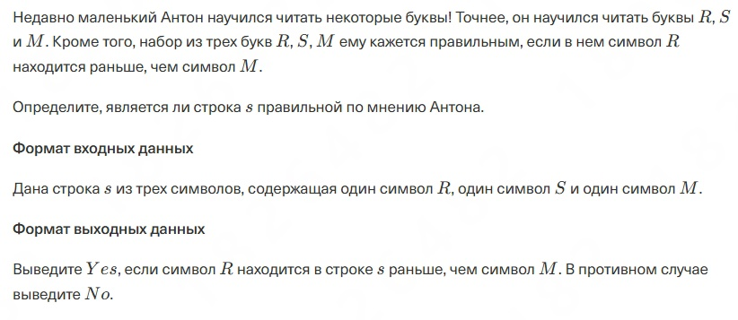
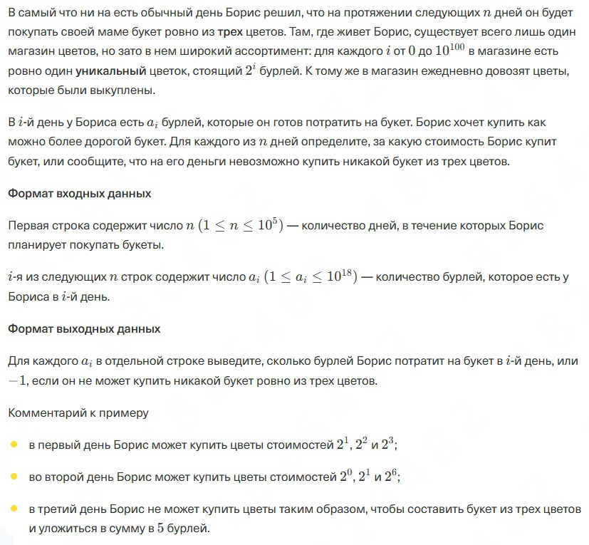
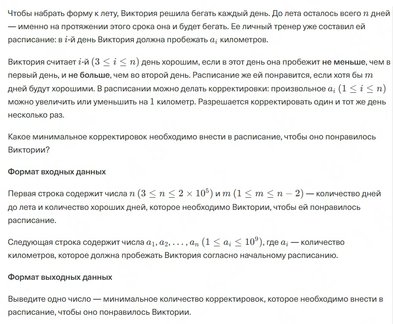
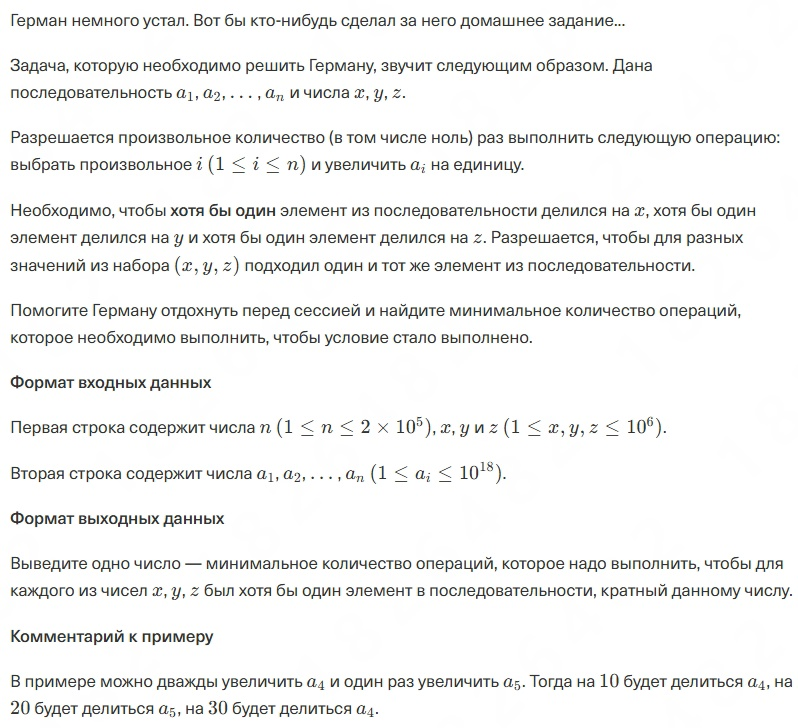
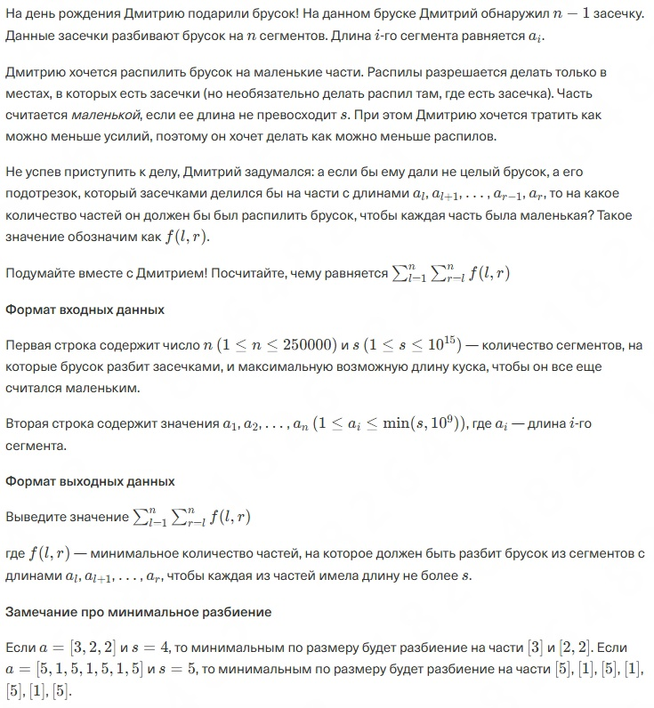
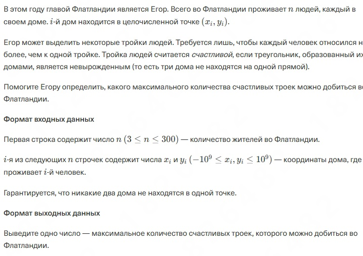
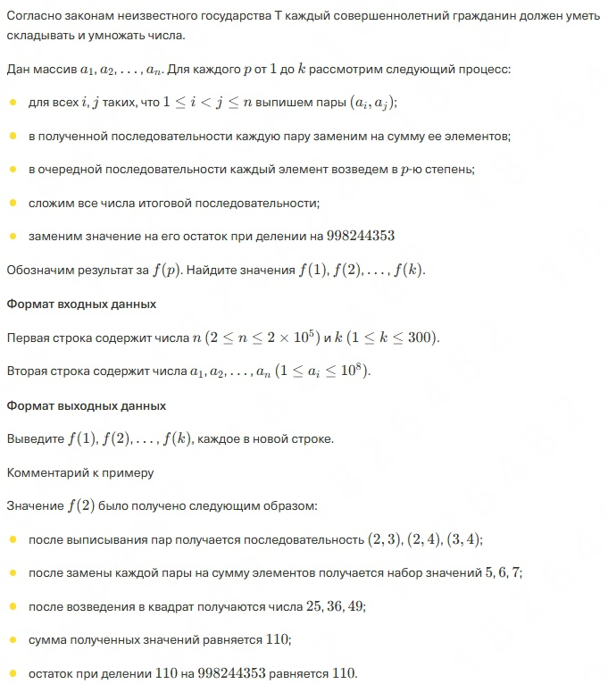

# TBank-ExamInternship
This project, you can familiarize yourself with the tasks that were set for students as part of the selection for the internship program organized by T-Bank. In total, the competition offered to solve seven tasks - for which up to four hours of time were allocated. You can choose a programming language from the proposed list and solve it in the one convenient for you.

I found an invitation to participate in this selection in the mail, but did not pay attention to it. On the weekend, I remembered this and decided to spend a couple of hours completing it in order to assess the level of tasks that are now offered for the intern position. Below I will attach the texts of the tasks and talk a little about them.

## Сontents
- [Technologies](#technologies)
- [Using](#using)
- [Tasks](#tasks)
- [Distribute](#distribute)
- [Developers](#developers)
- [Contributing](#contributing)
- [License](#license)

## Technologies
- [Jupyter Notebook](https://jupyter.org/)
- [Python](https://www.python.org/)
- ...

## Using
The Google Colaboratory cloud platform was used to complete the tasks. To reproduce the results, it is enough to run the attached code file in an environment capable of working with .ipynb. In total, there are seven tasks and seven cells to run, respectively.

## Tasks
You can read the texts of the tasks in this section below, you can see the solutions to the problems in the [notebook](Code/T_Exam_Solution.ipynb) with experiments.

I will not attach comments to each task in this case, since most of them are quite simple, tied to basic algorithms, but I will note that the fourth task is more interesting than it may seem, so if you have time, it will be interesting to look at your versions of its solution. Good luck!

P.S. These materials are published exclusively for educational and scientific-cognitive purposes and do not have the task of influencing the testing results, the repository is published after the end date of testing.

### Task 1

### Task 2

### Task 3

### Task 4

### Task 5

### Task 6

### Task 7

## Distribute
- [GitHub repository](https://github.com/EvgeniyKorovin1/TBank-ExamInternship)

## Developers
- [Evgeniy Korovin](https://github.com/EvgeniyKorovin1) — Programmer

## Contributing
To send feedback on the project or other interaction that can be associated with it, please use [email](https://mail.google.com/mail/?view=cm&fs=1&to=korovinevgeniyalexeyevich@gmail.com&su=TBank-ExamInternship), indicating the [repository](https://github.com/EvgeniyKorovin1/TBank-ExamInternship) as the subject of the letter.

## License
The license for the use of materials from this project can be viewed - [LICENSE](LICENSE).
